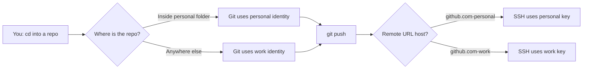
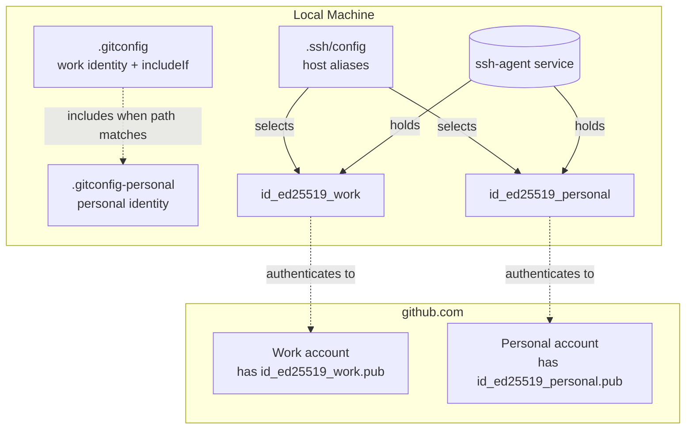
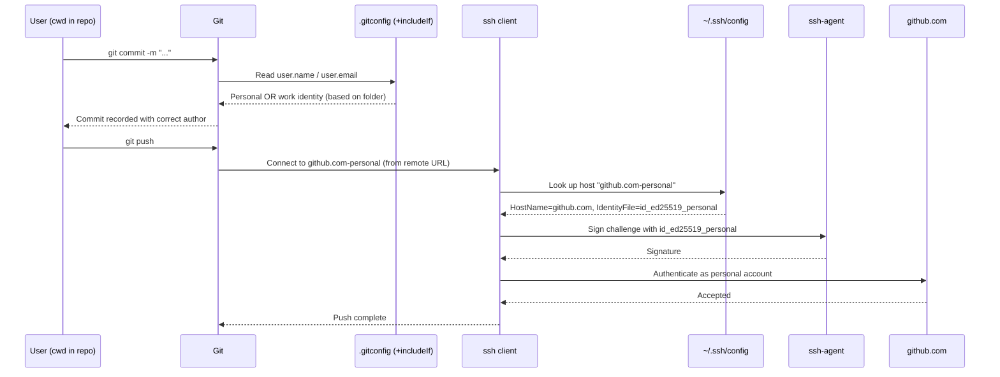

# Dual GitHub Accounts on Windows

> Run your **personal** and **work** GitHub accounts side-by-side on a single Windows machine — without ever logging in and out, switching profiles, or fumbling with credentials.


---

## At a Glance

Two switches operate **automatically**, with zero manual intervention:

| Switch                                 | Triggered by                     | Controls                         |
| -------------------------------------- | -------------------------------- | -------------------------------- |
| **Git commit identity** (name / email) | The folder a repo lives in       | What appears in `git log`        |
| **SSH key** (auth to GitHub)           | The host alias in the remote URL | Which GitHub account you push as |

After a one-time setup:

- `cd` into a personal folder → Git uses your personal name/email automatically.
- Clone (or set the remote) once using the right host alias (`github.com-personal` or `github.com-work`) → every push from that repo uses the correct SSH key automatically.

No "switch account" command, ever.

---

## Table of Contents

1. [Why This Guide](#why-this-guide)
2. [How It Works](#how-it-works)
3. [Architecture](#architecture)
4. [Prerequisites](#prerequisites)
5. [Part 1 — Git Identity per Folder](#part-1--git-identity-per-folder)
6. [Part 2 — SSH Keys per Account](#part-2--ssh-keys-per-account)
7. [Part 3 — SSH Config (Host Aliases)](#part-3--ssh-config-host-aliases)
8. [Daily Usage](#daily-usage)
9. [Verification](#verification)
10. [Troubleshooting](#troubleshooting)
11. [Optional — VS Code Profiles](#optional--vs-code-profiles)
12. [FAQ](#faq)
13. [Contributing](#contributing)
14. [License](#license)
15. [Suggested GitHub Topics](#suggested-github-topics)

---

## Why This Guide

If you have two GitHub accounts (e.g., a corporate one and a personal one), you've probably hit at least one of these:

- Commits to your portfolio show up under your work email
- `git push` to your personal repo fails with `Permission denied (publickey)`
- You keep signing in and out of GitHub in the browser
- You committed to the wrong account and had to rewrite history
- VS Code keeps reusing the wrong Copilot / GitHub session

This guide solves all of the above with a one-time setup. After that, switching is **invisible** — driven by where the repo lives on disk and what its remote URL points to.

---

## How It Works



Two completely independent mechanisms:

- **Git's `includeIf`** in `.gitconfig` matches your current folder and loads the right `user.name` / `user.email`
- **SSH host aliases** in `~/.ssh/config` route different "fake hostnames" to `github.com` while forcing a specific private key

---

## Architecture

### File layout

Everything lives under your Windows user profile (`%USERPROFILE%` = `C:\Users\<YourName>\`):

```text
C:\Users\<YourName>\
├── .gitconfig                   # Default (work) identity + includeIf rule
├── .gitconfig-personal          # Personal identity (loaded only inside personal folder)
├── .ssh\
│   ├── config                   # Host aliases → which key to use
│   ├── id_ed25519_work          # Work private key (NEVER share)
│   ├── id_ed25519_work.pub      # Work public key (upload to work GitHub)
│   ├── id_ed25519_personal      # Personal private key (NEVER share)
│   └── id_ed25519_personal.pub  # Personal public key (upload to personal GitHub)
└── Projects\
    ├── Personal\                # Any repo here → personal identity auto-applied
    │   └── my-portfolio\
    └── work-repo\               # Any repo outside Personal\ → work identity
```

### Component view



### Sequence: what happens on `git push`



### Why this works

- **GitHub doesn't care about email** — it identifies you purely by the SSH key. Two keys = two identities, regardless of what you set as `user.email`.
- **SSH doesn't actually contact `github.com-personal`** — that hostname only exists in your local `~/.ssh/config`. SSH rewrites it to the real `github.com` while picking the matching key.
- **`includeIf` is evaluated per-repo**, every time Git runs — so moving a folder in or out of the personal directory instantly changes its identity.

---

## Prerequisites

- Windows 10 or 11
- [Git for Windows](https://git-scm.com/download/win) installed (`git --version` should work)
- The built-in OpenSSH client (preinstalled on Windows 10+; verify with `ssh -V`)
- Two GitHub accounts you can sign into

---

## Part 1 — Git Identity per Folder

### Choose your folder convention

Pick **one folder** where ALL personal repos will live. Everything outside it defaults to your work identity.

| Account  | Folder rule (example)                    |
| -------- | ---------------------------------------- |
| Work     | Anywhere except the personal folder      |
| Personal | `C:\Users\<YourName>\Projects\Personal\` |

> Replace `<YourName>` and the path with what fits your machine. Avoid paths that change frequently.

### Step 1 — Create the global Git config

If you've never used Git before, the file won't exist yet. Create it by setting your work identity:

```powershell
git config --global user.name "<Your Work Name>"
git config --global user.email "<your-work-email@company.com>"
```

This creates `C:\Users\<YourName>\.gitconfig`.

### Step 2 — Add the `includeIf` block

Open the file:

```powershell
notepad $env:USERPROFILE\.gitconfig
```

Make it look like this (adjust path and emails):

```ini
[user]
    name = <Your Work Name>
    email = <your-work-email@company.com>

[includeIf "gitdir/i:C:/Users/<YourName>/Projects/Personal/"]
    path = .gitconfig-personal
```

**Critical rules:**

- Use **forward slashes** `/` in the path (not backslashes)
- Path **must end with `/`** (trailing slash) — without it, matching silently fails
- `gitdir/i` makes the match case-insensitive (recommended on Windows)
- Spaces in the path are fine because the value is inside quotes
- `path` is relative to your home folder

### Step 3 — Create the personal config

```powershell
notepad $env:USERPROFILE\.gitconfig-personal
```

```ini
[user]
    name = <Your Personal Name>
    email = <your-personal-email@example.com>
```

> **Tip:** to keep your real email out of public commits, use GitHub's no-reply address. Find it at <https://github.com/settings/emails> after enabling **Keep my email addresses private**. It looks like `12345678+username@users.noreply.github.com`.

### Step 4 — Create the personal folder

```powershell
mkdir "C:\Users\<YourName>\Projects\Personal"
```

### Step 5 — Verify

```powershell
# Work repo (or any folder outside Personal\)
cd C:\Users\<YourName>\Projects\some-work-repo
git config user.email
# → <your-work-email@company.com>

# Personal repo
cd C:\Users\<YourName>\Projects\Personal\
git init test-repo
cd test-repo
git config user.email
# → <your-personal-email@example.com>

# Cleanup
cd ..
Remove-Item -Recurse -Force test-repo
```

---

## Part 2 — SSH Keys per Account

You'll generate one ed25519 key per account and upload each public key to the matching GitHub account.

### Step 1 — Create the `.ssh` folder if missing

```powershell
mkdir $env:USERPROFILE\.ssh
```

### Step 2 — Generate two keys

```powershell
# Work key
ssh-keygen -t ed25519 -C "<your-work-email@company.com>" -f "$env:USERPROFILE\.ssh\id_ed25519_work"

# Personal key
ssh-keygen -t ed25519 -C "<your-personal-email@example.com>" -f "$env:USERPROFILE\.ssh\id_ed25519_personal"
```

Press **Enter** twice at the passphrase prompt for no passphrase (or set one if you prefer — you'll need to type it on each first push).

### Step 3 — Enable the ssh-agent

Open **PowerShell as Administrator** (one-time setup):

```powershell
Get-Service ssh-agent | Set-Service -StartupType Automatic
Start-Service ssh-agent
```

Then close the admin window and, in normal PowerShell:

```powershell
ssh-add $env:USERPROFILE\.ssh\id_ed25519_work
ssh-add $env:USERPROFILE\.ssh\id_ed25519_personal
```

Each command should print `Identity added: ...`.

### Step 4 — Upload public keys to GitHub

```powershell
# Work
Get-Content $env:USERPROFILE\.ssh\id_ed25519_work.pub | Set-Clipboard
```

Sign in to your **work** GitHub account → <https://github.com/settings/keys> → **New SSH key** → give it a name (e.g., "Work Laptop") → paste → **Add SSH key**.

```powershell
# Personal
Get-Content $env:USERPROFILE\.ssh\id_ed25519_personal.pub | Set-Clipboard
```

Sign in to your **personal** GitHub account → <https://github.com/settings/keys> → **New SSH key** → paste → save.

> **Never share or commit the private key files** (`id_ed25519_work` / `id_ed25519_personal`). Only the `.pub` files go to GitHub.

---

## Part 3 — SSH Config (Host Aliases)

This is the bridge: it lets you address the same `github.com` server under two different "names," each forced to use a specific key.

### Create the config file

```powershell
notepad $env:USERPROFILE\.ssh\config
```

Paste:

```ssh-config
Host github.com-work
    HostName github.com
    User git
    IdentityFile ~/.ssh/id_ed25519_work
    IdentitiesOnly yes

Host github.com-personal
    HostName github.com
    User git
    IdentityFile ~/.ssh/id_ed25519_personal
    IdentitiesOnly yes
```

Save and close.

> **Notepad gotcha:** Notepad sometimes saves files with a hidden `.txt` extension. Verify with `ls $env:USERPROFILE\.ssh`. If you see `config.txt`, rename it:
>
> ```powershell
> Rename-Item $env:USERPROFILE\.ssh\config.txt config
> ```

**Why `IdentitiesOnly yes`?** Without it, the ssh-agent offers every loaded key to GitHub on each connection. After a few wrong keys, GitHub rate-limits you and the connection fails.

### Test both aliases

```powershell
ssh -T git@github.com-work
ssh -T git@github.com-personal
```

The first time each runs, you'll be asked to trust the host fingerprint — type `yes`. Expected output:

```
Hi <work-username>! You've successfully authenticated, but GitHub does not provide shell access.
Hi <personal-username>! You've successfully authenticated, but GitHub does not provide shell access.
```

---

## Daily Usage

You **never run a "switch" command**. The right account is selected automatically by **where the repo lives** and **what the remote URL says**.

### Clone a personal repo

```powershell
cd C:\Users\<YourName>\Projects\Personal
git clone git@github.com-personal:<personal-username>/<repo>.git
```

### Clone a work repo

```powershell
cd C:\Users\<YourName>\Projects   # or anywhere outside Personal\
git clone git@github.com-work:<org-or-user>/<repo>.git
```

### Create a brand-new personal repo

```powershell
cd C:\Users\<YourName>\Projects\Personal
mkdir my-portfolio
cd my-portfolio
git init
git remote add origin git@github.com-personal:<personal-username>/my-portfolio.git
git add .
git commit -m "initial commit"
git branch -M main
git push -u origin main
```

### Fix an already-cloned repo (wrong remote)

If you cloned with `https://...` or used `github.com` instead of an alias:

```powershell
# Personal repo
git remote set-url origin git@github.com-personal:<personal-username>/<repo>.git

# Work repo
git remote set-url origin git@github.com-work:<org>/<repo>.git
```

Confirm:

```powershell
git remote -v
```

### Switching context during the day

- Personal work → `cd` into a folder under `…\Personal\`. Done.
- Work work → `cd` anywhere else. Done.
- No environment variables, no scripts, no aliases.

---

## Verification

Run these any time to confirm everything is wired up correctly.

```powershell
# Identity inside the current repo
git config user.name
git config user.email

# Full effective config and source files
git config --list --show-origin --global

# Keys currently loaded in the agent
ssh-add -l

# Auth test for each account
ssh -T git@github.com-work
ssh -T git@github.com-personal

# Where Git thinks the repo root is (must start with your personal folder prefix for personal identity)
git rev-parse --show-toplevel
```

---

## Troubleshooting

| Symptom                                                                         | Likely Cause                                                                                                | Fix                                                                       |
| ------------------------------------------------------------------------------- | ----------------------------------------------------------------------------------------------------------- | ------------------------------------------------------------------------- |
| `git config user.email` shows work email in a personal repo                     | Missing trailing `/` in `includeIf` path, or repo not actually inside the personal folder                   | Add trailing `/`; run `git rev-parse --show-toplevel` to confirm location |
| `ssh: Could not resolve hostname github.com-work`                               | SSH config not being read (often saved as `config.txt` by Notepad)                                          | `ls $env:USERPROFILE\.ssh` — if you see `config.txt`, rename to `config`  |
| `Saving key failed: No such file or directory` during keygen                    | `.ssh` folder doesn't exist                                                                                 | `mkdir $env:USERPROFILE\.ssh` first                                       |
| `Permission denied (publickey)` on push                                         | Public key not added to the right GitHub account, or remote URL uses bare `github.com` instead of the alias | Re-upload key; check `git remote -v` and use `git remote set-url`         |
| Pushes go to the wrong account                                                  | Remote URL uses bare `github.com` instead of the alias                                                      | Use `git remote set-url origin git@github.com-<personal\|work>:...`       |
| `Hi <wrong-user>!` on `ssh -T`                                                  | Key is uploaded to the wrong GitHub account                                                                 | Remove key on that account, upload to the correct one                     |
| `ssh-add` fails with "Could not open a connection to your authentication agent" | ssh-agent service not running                                                                               | Start it via the admin-PowerShell commands in Part 2, Step 3              |
| Personal config seems totally ignored                                           | Folder path uses backslashes, or doesn't match the actual repo location                                     | Use forward slashes, add trailing `/`, double-check the prefix            |

---

## Optional — VS Code Profiles

For a fully separated editor experience (different extensions, theme, settings, and Copilot/GitHub sign-in per account):

1. Open Command Palette (<kbd>Ctrl</kbd>+<kbd>Shift</kbd>+<kbd>P</kbd>) → **Profiles: Create Profile**
2. Create two profiles: `Work` and `Personal`
3. Sign into the matching GitHub / Copilot account in each
4. Switch via Command Palette → **Profiles: Switch Profile**
5. Launch a specific profile from the terminal:
   ```powershell
   code --profile "Personal" "C:\Users\<YourName>\Projects\Personal\my-portfolio"
   code --profile "Work" "C:\Users\<YourName>\Projects\work-repo"
   ```
6. Pin Windows taskbar shortcuts with each command pre-set for one-click launches.

---

## FAQ

**Q: Does this work with HTTPS instead of SSH?**
Partially. Windows Credential Manager can store one credential per host, so two accounts on `github.com` collide. You can work around it by using different "hosts" via `insteadOf` rules — but SSH is significantly simpler for the dual-account case.

**Q: What if I want three or more accounts?**
The same pattern scales. Add another `[includeIf]` block, another key pair, and another `Host` entry in the SSH config.

**Q: Can I store the private keys on a USB drive or removable disk?**
Yes — point `IdentityFile` at that path. Just know that pushes will fail when the drive is disconnected.

**Q: What about Git LFS / GitHub CLI / VS Code's built-in GitHub auth?**
Git LFS uses the remote URL, so host aliases work fine. The `gh` CLI manages its own auth; run `gh auth login` once per account and use `gh auth switch` when needed. VS Code's GitHub integration is per-profile (see [VS Code Profiles](#optional--vs-code-profiles)).

**Q: Will Git Bash / WSL / macOS work with this?**
The `.gitconfig` and `~/.ssh/config` patterns are identical on every platform. Only the paths in the examples (`C:\Users\...`) need to change.

**Q: I committed under the wrong identity — how do I fix it?**
For unpushed commits: `git commit --amend --author="Name <email>"`. For multiple commits, use `git rebase -i` and amend each, or `git filter-repo` for bulk rewrites. Be cautious if commits are already pushed.

---

## Contributing

Found a bug, an OS quirk, or a clearer way to explain something? PRs welcome.

1. Fork the repo
2. Create a branch: `git checkout -b improve-troubleshooting`
3. Commit your changes
4. Open a Pull Request

---

## License

[MIT](LICENSE) — use it, fork it, share it.

---

### Suggested social preview / description

> Run personal and work GitHub accounts on the same Windows machine — automatic identity and SSH key switching, no manual login required.
